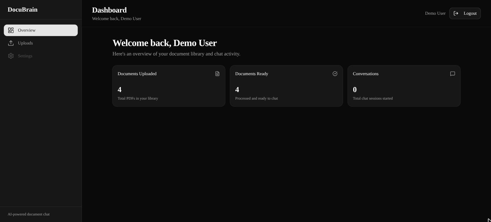
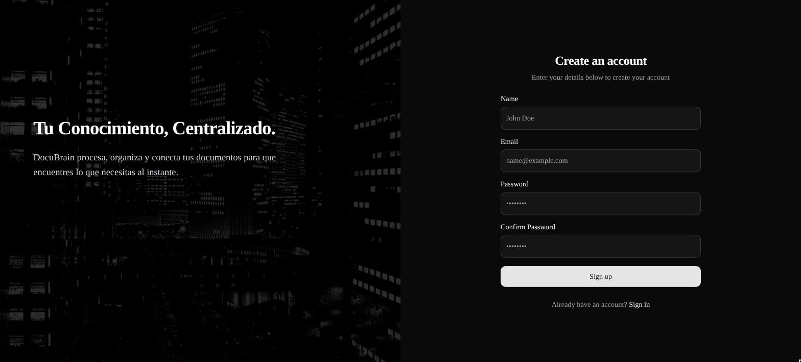
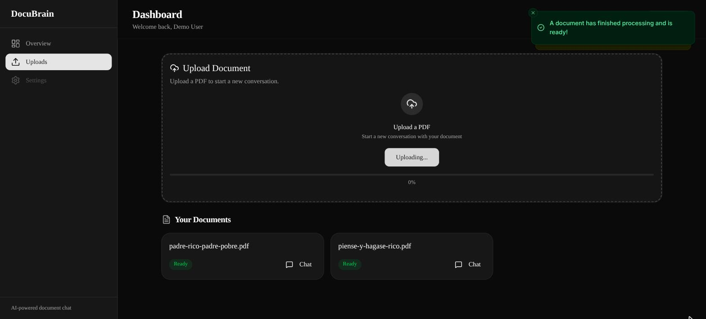
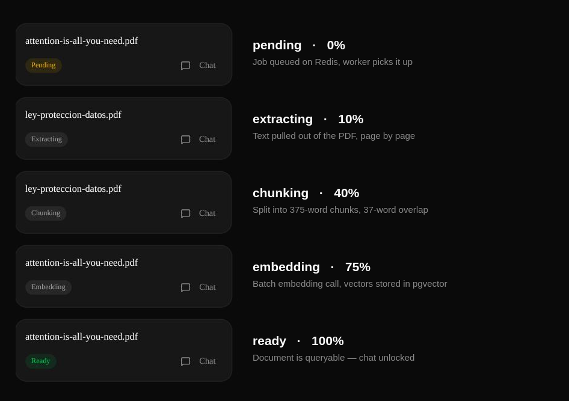
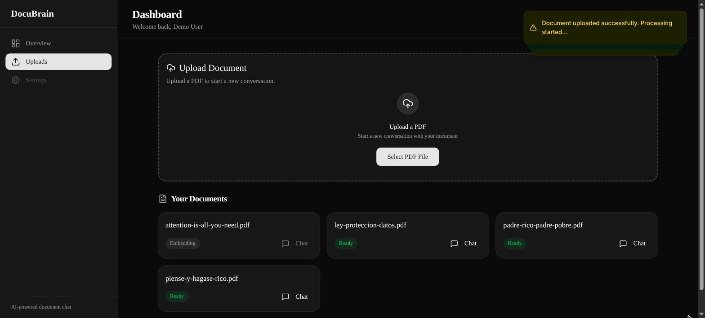
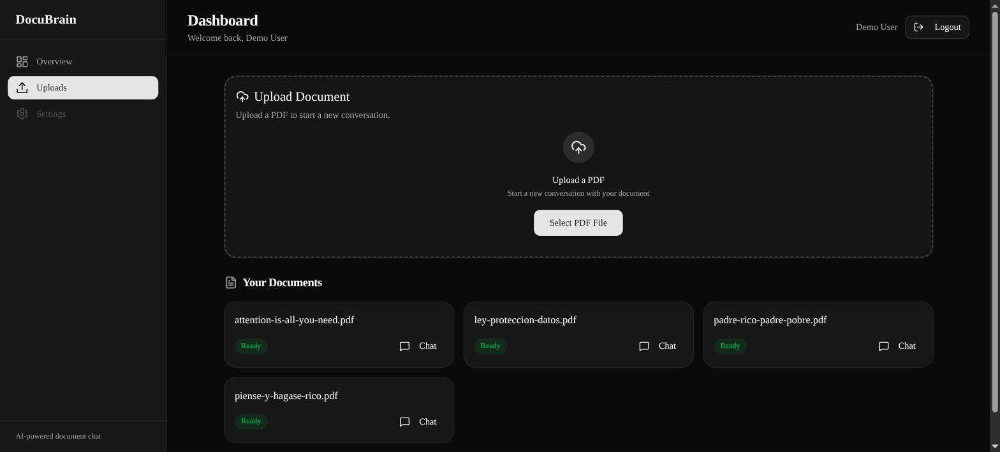
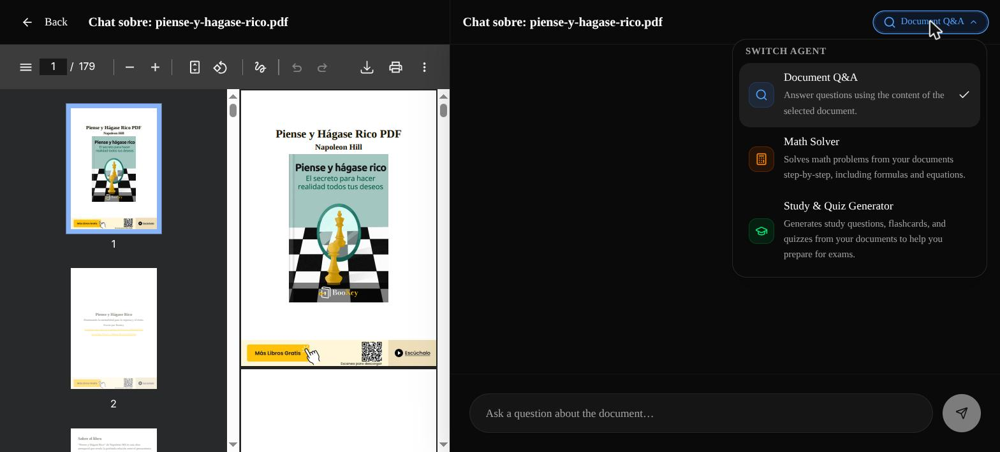
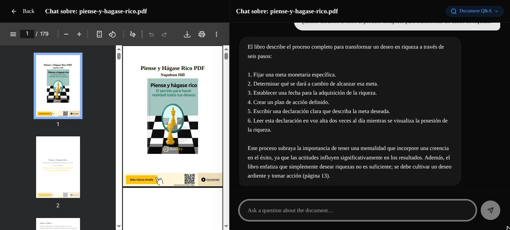
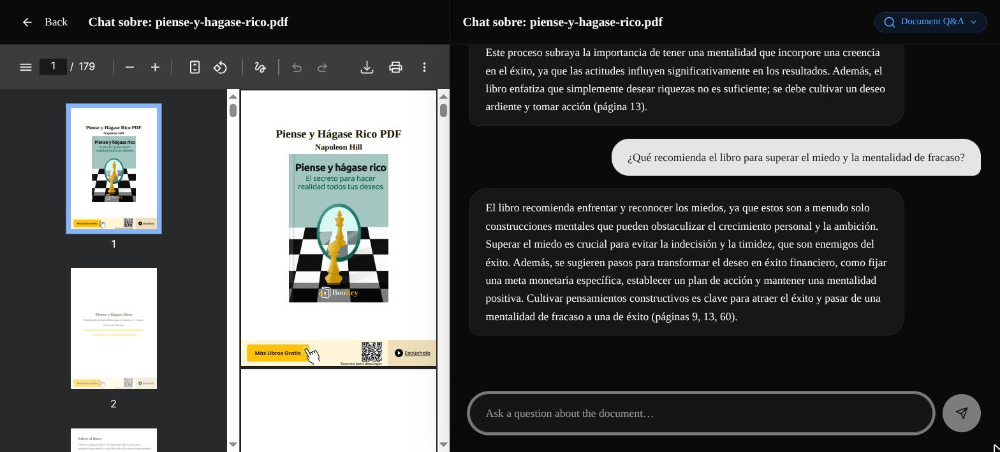

# DocuBrain

**Your documents, backed by specialized AI agents that know when to say "that's not in here".**

[](https://laravel.com)
[](https://php.net)
[](https://lighthouse-php.com)
[](https://postgresql.org)
[](https://github.com/pgvector/pgvector)
[](https://redis.io)
[](https://nextjs.org)
[](https://react.dev)
[](https://typescriptlang.org)
[](https://tailwindcss.com)
[](https://docs.docker.com/compose)
[](https://openrouter.ai)

[](https://github.com/Sunshide12/DocuBrain-API/pulls)
[](https://github.com/Sunshide12/DocuBrain-API)
[](https://github.com/Sunshide12/DocuBrain-API)

---




---

## 🎬 See it running

Upload → queue-backed processing → ask a question → get a grounded answer with page citations:


> **Note on language:** the codebase is in English, but the product UI answers users in Spanish by design — so the screenshots show a Spanish interface.

---

## 🎯 What is this project?

**DocuBrain** is a RAG (Retrieval-Augmented Generation) API and web client. You upload a PDF, the system extracts, chunks and embeds it into pgvector, and from that moment you can hold a conversation with **specialized AI agents** that answer strictly from the content of *your* documents — citing the pages they used.

The interesting part is not the chat. It is the **agent layer**: every message is routed through a centralized `IntentClassifier` that figures out what the user actually wants, verifies the mentioned topic against the document *before* the agent runs, and hands the agent a typed `ClassifiedIntent`. Agents never guess, and never quietly answer with unrelated content.

### What it does, exactly

- **Registers and authenticates** users with Laravel Sanctum tokens over GraphQL
- **Ingests PDFs** and processes them asynchronously on a Redis queue — the HTTP request never blocks on extraction or embeddings
- **Chunks by page** (375 words, 37-word overlap) so every chunk keeps a `page_number` and answers can cite real pages
- **Embeds** each chunk with `text-embedding-3-small` and stores a `vector(1536)` column in PostgreSQL + pgvector
- **Broadcasts live progress** over Laravel Reverb (WebSockets) so the UI shows `extracting → chunking → embedding → ready` in real time
- **Classifies intent** on every message and verifies the topic exists in the document via cosine similarity before letting an agent answer
- **Routes to one of three agents** — document Q&A, step-by-step math solving, or quiz generation — each declaring the intents it supports
- **Answers with sources**, appending the page numbers the retrieved chunks came from

> ⚠️ **Scope of this repo:** this is a personal learning project built to go deep on GraphQL, Postgres internals, queues and RAG architecture. It runs locally on Docker Compose. Production deployment, billing, and multi-tenant hardening are out of scope — see [Roadmap](#-roadmap--technical-decisions).

---

## 🗺 Demo flow

```
http://localhost:3000
        │
        ▼
[/]  Public landing
        │
        ▼
[/register]  Sign up → Sanctum token stored client-side
        │
        ▼
[/dashboard]  KPI overview: documents uploaded / ready / conversations
        │
        ▼
[/dashboard/uploads]  Select a PDF → dispatched to the Redis queue
        │                                  │
        │                                  ▼
        │                    ProcessDocumentJob (worker)
        │                    extract → chunk → embed → ready
        │                    live progress via Reverb WebSockets
        ▼
[/chat/:id]  Split view: PDF viewer + chat
        │
        ├─ Pick an agent (Document Q&A · Math Solver · Quiz Generator)
        │
        └─ Ask → IntentClassifier → Agent::handle() → answer + page citations
```

### Step 1 — Sign up

Split auth layout, Sanctum token issued on success and stored client-side.



### Step 2 — Land on an empty dashboard

Three KPIs read straight from the `userStats` query. Nothing uploaded yet.


### Step 3 — Upload a PDF

The file goes up over `POST /api/documents/upload`, the request returns immediately, and the job is already sitting on the Redis queue.



---

## ⚙️ The document pipeline

This is the part most RAG demos hide. When you drop a PDF into DocuBrain, `ProcessDocumentJob` walks it through five observable states — plus a failure state — and broadcasts each transition to the browser as it happens:



| Status | Progress | What actually happens | Where |
|---|---|---|---|
| `pending` | 0% | `POST /api/documents/upload` stores the file and dispatches `ProcessDocumentJob` onto the Redis queue. The HTTP response returns immediately. | `DocumentUploadController` |
| `extracting` | 10% | `spatie/pdf-to-text` shells out to `pdftotext`, then the output is split on the form-feed character (`\x0C`) that poppler emits between pages — that is how every chunk keeps a real `page_number`. | `PdfTextExtractor` |
| `chunking` | 40% | Each page is split into ~375-word chunks with a 37-word overlap. The overlap keeps sentences that straddle a boundary retrievable. | `ProcessDocumentJob::chunkTextByPage()` |
| `embedding` | 75% | Chunks are embedded in **batches of 100 per HTTP call** instead of one call per chunk, then bulk-inserted as `vector(1536)`. A 255-chunk book costs 3 requests, not 255. | `OpenRouterEmbeddingProvider::embedBatch()` |
| `ready` | 100% | `DocumentProcessed` event fires, the chat unlocks, and the document becomes queryable. | — |
| `failed` | — | Any throwable is caught, `error_message` is persisted, and the job is retried up to 3 times with a 10s backoff. | — |

The job is **idempotent**: it deletes previous chunks before starting, so a retry never duplicates data.

Real numbers, measured on the demo library in the screenshots below:

| Document | Pages | Chunks generated | Wall time |
|---|---|---|---|
| *Piense y Hágase Rico* (2.9 MB) | 179 | 158 | ~3 s |
| *Padre Rico, Padre Pobre* (344 KB) | 98 | 255 | ~8 s |
| *Ley Orgánica 3/2018* — Spanish GDPR act (530 KB) | 68 | 155 | ~7 s |
| *Attention Is All You Need* (2.2 MB) | 15 | 26 | ~4 s |

Chunk count tracks **extracted text**, not file size or page count: the 344 KB Kiyosaki book yields 255 chunks while the 2.9 MB, 179-page Hill book yields only 158 — its pages carry far less machine-readable text per page. Useful to keep in mind when estimating embedding cost.

Caught mid-flight, `embedding` looks like this:



And once every document lands on `ready`:



---

## 🤖 The agent system

Every single message goes through the same path — there are no shortcuts and no agent talks to the LLM to figure out intent on its own:

```
sendMessage mutation
    └── IntentClassifier::classify(message, agent.supportedIntents(), document, userId)
            ├── LLM call → { intent, topic, confidence }
            └── if a topic was extracted → pgvector similarity search on the document
                                            → topicInDocument: true | false
        └── Agent::handle(AgentContext)          ← receives a typed ClassifiedIntent
                ├── intent->isChat()          → friendly conversational reply
                ├── intent->isTopicMissing()  → "that's not in this document"
                └── otherwise                 → the agent's real work
            └── AgentResponse { answer, sourceChunks, responseType, metadata }
```

### The three agents



| Agent | Key | Supported intents | What it does |
|---|---|---|---|
| **Document Q&A** | `document_qa` | `ask_question`, `summarize` | Retrieves the most similar chunks above the similarity threshold and answers strictly from them, appending the page numbers used. |
| **Math Solver** | `math_solver` | `solve_problem`, `explain_step` | Solves problems found in the document step by step and returns LaTeX the frontend renders with KaTeX. |
| **Study & Quiz Generator** | `quiz_generator` | `generate_quiz` | Builds multiple-choice and open-ended questions from the document and persists them as a `Quiz` the UI renders in a side panel. |

`chat` is an **implicit** intent supported by every agent — it is the fallback, never something an agent declares.

### Response types

Agents return a typed `AgentResponse`, and `responseType` tells the frontend how to render it:

| `responseType` | When | Rendered as |
|---|---|---|
| `text` | Conversational reply, refusal, explanation | Standard assistant bubble |
| `quiz` | A quiz was generated | Accordion in the quiz panel + confirmation bubble in chat |
| `steps` | Step-by-step math solution | Chat bubble with LaTeX support |

### Adding a new agent

Implement `App\Services\Contracts\AgentHandler` (four methods: `key()`, `name()`, `description()`, `supportedIntents()`, plus `handle()`) and register it in `AgentServiceProvider::boot()`:

```php
$registry->register($this->app->make(MyNewAgent::class));
```

That is the whole integration. The `IntentClassifier` picks up the new intents automatically — no switch statements to update, no routing table to edit. See [`CLAUDE.md`](CLAUDE.md) for the full contract.

### It answers with sources

Ask something the document covers and you get a grounded answer with the pages it came from:





---

## 🛠 Tech stack

### Backend

| Technology | Version | Purpose |
|---|---|---|
| **Laravel** | 13.8 | Application framework |
| **PHP** | 8.5 | Runtime (`php:8.5-cli` base image) |
| **Lighthouse** | 6.68 | GraphQL server — schema-first, directive-driven |
| **Laravel Sanctum** | 4.x | Token authentication for the SPA |
| **Laravel Reverb** | 1.10 | First-party WebSocket server for live processing progress |
| **pgvector/pgvector** (PHP) | 0.2.2 | Vector type casting + `<=>` cosine distance queries from Eloquent |
| **spatie/pdf-to-text** | 1.55 | Page-aware text extraction from PDFs |
| **PHPUnit** | 12.5 | Test suite |

### Frontend

| Technology | Version | Purpose |
|---|---|---|
| **Next.js** | 16.2.10 | App Router, Turbopack dev server |
| **React** | 19.2.4 | UI |
| **TypeScript** | 5.x | Strict typing across the app |
| **TanStack Query** | 5.101 | Server state, caching and invalidation |
| **graphql-request** | 7.4 | Thin GraphQL client (`@/lib/graphql`) |
| **Tailwind CSS** | v4 | Styling |
| **shadcn/ui** | — | Component primitives (`components/ui`) |
| **laravel-echo + pusher-js** | 2.4 / 8.5 | Reverb WebSocket subscription for document progress |
| **KaTeX** | 0.18 | LaTeX rendering for the Math Solver agent |
| **sonner** | 2.x | Toast notifications |
| **lucide-react** | 1.24 | Icons |

### Data & infrastructure

| Technology | Version | Purpose |
|---|---|---|
| **PostgreSQL** | 18 | Primary datastore |
| **pgvector** | 0.8.4 | `vector(1536)` column + cosine distance operator |
| **Redis** | 7-alpine | Queue driver **and** cache store |
| **Docker Compose** | — | `postgres`, `redis`, `app`, `reverb` |

### AI models (via OpenRouter)

| Model | Role |
|---|---|
| `openai/text-embedding-3-small` | Chunk and query embeddings — 1536 dimensions |
| `openai/gpt-4o-mini` | Intent classification and agent answers |

Both are configurable through `EMBEDDING_MODEL` / `LLM_MODEL`, so swapping providers is an env change, not a code change.

---

## 🏗️ Architecture

### RAG, end to end

```
                    INGESTION (async, Redis queue)
┌──────────────────────────────────────────────────────────────┐
│  PDF  →  page-aware text  →  375-word chunks (37 overlap)    │
│           │                          │                        │
│           │                          ▼                        │
│           │              batch embed → vector(1536)           │
│           ▼                          │                        │
│      page_number kept                ▼                        │
│      on every chunk        document_chunks (pgvector)         │
└──────────────────────────────────────────────────────────────┘

                    QUERY (synchronous, per message)
┌──────────────────────────────────────────────────────────────┐
│  user question                                                │
│      │                                                        │
│      ├─→ IntentClassifier                                     │
│      │      ├─ LLM: intent + topic                            │
│      │      └─ pgvector: is the topic actually in the doc?    │
│      │                                                        │
│      ├─→ embed(question)                                      │
│      │      └─ cosine search, threshold 0.35, scoped to the   │
│      │         user's own document                            │
│      │                                                        │
│      └─→ agent builds a prompt from the retrieved chunks      │
│              └─ LLM answer + page numbers of the sources      │
└──────────────────────────────────────────────────────────────┘
```

### Why the processing is queued

Extracting a 179-page PDF and embedding 158 chunks takes seconds, not milliseconds — and the embedding call is a network round trip to a third party. Doing that inside the HTTP request would mean a request that hangs for seconds and dies on any gateway timeout. `ProcessDocumentJob` is dispatched to Redis, the upload endpoint returns immediately with a `pending` document, and the worker broadcasts progress over Reverb so the UI stays honest about what is happening.

Run the worker with:

```bash
docker compose exec app php artisan queue:work
```

### Why brute-force vector search (for now)

`PgvectorSimilaritySearch` runs a sequential scan with the `<=>` cosine operator and no HNSW index. That is deliberate: below ~10K chunks a sequential scan is faster than maintaining an approximate index, and an HNSW index only starts paying for itself around ~100K rows. The decision is documented, not accidental — see [`docs/decisions/001-documents-query-performance.md`](docs/decisions/001-documents-query-performance.md).

### Two similarity thresholds

There are deliberately two different thresholds in play, and they answer different questions:

| Constant | Value | Question it answers |
|---|---|---|
| `SIMILARITY_THRESHOLD` (env) | `0.35` | "Which chunks are relevant enough to feed the LLM?" |
| `TOPIC_RELEVANCE_THRESHOLD` (`IntentClassifier`) | `0.50` | "Does this document cover the topic at all?" — needs ≥2 chunks above the bar |

> ⚠️ **Known issue:** the topic gate is stricter than the retrieval it guards, and a bare topic string ("autosugestión") embedded against 375-word chunks lands in the 0.45–0.50 band even when the document clearly covers it. The result is false "not in this document" replies for narrow or cross-language topics. Tracked as a tuning task — see [Roadmap](#-roadmap--technical-decisions).

---

## 📁 Project structure

```
DocuBrain-API/
│
├── 📄 docker-compose.yml          # postgres · redis · app · reverb
├── 📄 CLAUDE.md                   # Contributor contract: agent system rules
├── 📄 DOCUBRAIN_SPEC.md           # Full spec + phase roadmap
│
├── 📁 docker/
│   ├── app/Dockerfile             # PHP 8.5-cli + extensions
│   └── postgres/Dockerfile        # Postgres 18 + pgvector 0.8.4 + init.sql
│
├── 📁 docs/
│   ├── decisions/                 # ADRs (see Roadmap)
│   └── screenshots/               # Images used in this README
│
├── 📁 Casos-Estudio/              # Deep-dive write-ups on the patterns used
│                                  # (DTOs, DI, interfaces, registry, events, agents…)
│
├── 📁 backend/                    # Laravel 13
│   ├── graphql/schema.graphql     # ★ Source of truth for the API
│   └── app/
│       ├── Agents/
│       │   ├── AgentRegistry.php          # Singleton registry, key → handler
│       │   ├── DocumentQAAgent.php        # ★ Retrieval + grounded answers
│       │   ├── MathSolverAgent.php        # Step-by-step solutions (LaTeX)
│       │   └── QuizGeneratorAgent.php     # Quiz + flashcard generation
│       ├── DTOs/
│       │   ├── AgentContext.php           # What every agent receives
│       │   ├── AgentResponse.php          # Typed agent output
│       │   └── ClassifiedIntent.php       # intent · topic · topicInDocument
│       ├── Services/
│       │   ├── Contracts/
│       │   │   ├── AgentHandler.php       # ★ The interface every agent implements
│       │   │   ├── EmbeddingProvider.php
│       │   │   └── TextExtractor.php
│       │   ├── IntentClassifier.php       # ★ Centralized intent + topic gate
│       │   └── PgvectorSimilaritySearch.php
│       ├── Jobs/
│       │   ├── ProcessDocumentJob.php     # ★ extract → chunk → embed → ready
│       │   ├── ProcessMathExtractionJob.php
│       │   └── GenerateAutoQuizJob.php
│       ├── Events/
│       │   ├── DocumentProgressUpdated.php  # Broadcast to Reverb
│       │   └── DocumentProcessed.php
│       ├── GraphQL/
│       │   ├── Mutations/SendMessage.php  # ★ Orchestrates the whole message flow
│       │   └── Queries/
│       └── Providers/AgentServiceProvider.php  # Agent registration
│
└── 📁 frontend/                   # Next.js 16
    └── src/
        ├── app/
        │   ├── page.tsx           # / — public landing
        │   ├── login/ · register/
        │   ├── dashboard/         # KPI overview
        │   │   └── uploads/       # Upload panel + document library
        │   └── chat/[id]/         # Split view: PDF viewer + chat
        ├── components/
        │   ├── agents/            # AgentPickerModal · AgentSwitcher
        │   ├── chat/              # message-bubble · MathRenderer · typing-indicator
        │   ├── dashboard/         # kpi-card · document-card · status-badge · upload-panel
        │   ├── quiz/              # QuizPanel · QuizCard · OpenEndedCard
        │   └── ui/                # shadcn/ui primitives
        └── lib/graphql.ts         # graphql-request client
```

---

## 🗄️ Database

```
users
  │
  └─ 1:N ─── documents ─── 1:N ─── document_chunks   (embedding vector(1536))
                │                       │
                │                       └─ page_number keeps citations honest
                │
                ├─ 1:N ─── conversations ─── 1:N ─── messages
                │              │
                │              └─ agent_type: which agent owns this thread
                │
                ├─ 1:N ─── quizzes ─── 1:N ─── quiz_questions
                │
                └─ 1:N ─── document_math_pages
```

### `documents`

```sql
id              bigserial PRIMARY KEY
user_id         bigint NOT NULL REFERENCES users(id) ON DELETE CASCADE
title           varchar NULL
original_name   varchar NOT NULL
file_path       varchar NOT NULL
mime_type       varchar NOT NULL
size            bigint NOT NULL
status          varchar NOT NULL DEFAULT 'pending'
                -- pending | extracting | chunking | embedding | ready | failed
error_message   text NULL
created_at, updated_at
```

Indexes: `idx_documents_status` (simple) plus a composite `(user_id, created_at)` — the library query filters by owner and orders by recency in one pass. The `EXPLAIN ANALYZE` before/after is written up in [ADR 001](docs/decisions/001-documents-query-performance.md).

### `document_chunks`

```sql
id            bigserial PRIMARY KEY
document_id   bigint NOT NULL REFERENCES documents(id) ON DELETE CASCADE
chunk_index   integer NOT NULL          -- 0-based position within the document
content       text NOT NULL
token_count   integer
page_number   integer                   -- what makes page citations possible
embedding     vector(1536)              -- pgvector
```

Indexes: FK index on `document_id`, plus a composite `(document_id, chunk_index)` so ordered reads are an Index Scan instead of Seq Scan + Sort.

The vector column is added in a separate migration with raw SQL, because Laravel's schema builder has no native `vector` type:

```php
DB::statement('ALTER TABLE document_chunks ADD COLUMN IF NOT EXISTS embedding vector(1536)');
```

Cosine similarity search is exposed through an Eloquent scope that degrades gracefully on SQLite (used in tests, where `<=>` does not exist):

```php
// DocumentChunk::scopeSimilarTo()
// similarity = 1 - distance, so "similarity >= threshold" is "distance <= 1 - threshold"
$query->whereRaw('embedding <=> ? <= ?', [$vector, 1 - $threshold])
      ->orderByRaw('embedding <=> ?', [$vector]);
```

### `conversations` / `messages`

`conversations` carries `agent_type`, with a unique constraint on `(user_id, document_id, agent_type)` — one thread per agent per document, so switching agents gives you a clean context instead of a confused one. `messages` stores `response_type` and a `metadata` JSON payload (e.g. `{"quiz_id": 4}`) so the frontend knows how to render each bubble.

---

## 🔐 Environment variables

### Backend — `backend/.env`

```bash
cp backend/.env.example backend/.env
```

| Variable | Example | Purpose |
|---|---|---|
| `APP_URL` | `http://localhost:8000` | Base URL of the API |
| `DB_CONNECTION` | `pgsql` | Must be Postgres — pgvector is not optional |
| `DB_HOST` / `DB_PORT` | `postgres` / `5432` | Compose service name |
| `DB_DATABASE` / `DB_USERNAME` / `DB_PASSWORD` | `docubrain` | Credentials |
| `REDIS_HOST` / `REDIS_PORT` | `redis` / `6379` | Compose service name |
| `QUEUE_CONNECTION` | `redis` | Document processing runs on the queue |
| `CACHE_STORE` | `redis` | Document list is cached per user for 5 min |
| `BROADCAST_CONNECTION` | `reverb` | Live progress over WebSockets |
| `OPENROUTER_API_KEY` | `sk-or-…` | **Secret.** LLM + embeddings gateway |
| `OPENROUTER_BASE_URL` | `https://openrouter.ai/api/v1` | API base |
| `EMBEDDING_MODEL` | `openai/text-embedding-3-small` | Must match the `vector(1536)` column |
| `LLM_MODEL` | `openai/gpt-4o-mini` | Intent classification + answers |
| `SIMILARITY_THRESHOLD` | `0.35` | Minimum cosine similarity for retrieval |
| `PROCESS_DOCUMENT_TIMEOUT` | `300` | Seconds before `ProcessDocumentJob` times out |

> Changing `EMBEDDING_MODEL` to a model with a different dimensionality requires a migration on the `embedding` column **and** re-processing every document.

### Frontend — `frontend/.env.local`

| Variable | Example | Purpose |
|---|---|---|
| `NEXT_PUBLIC_GRAPHQL_URL` | `http://localhost:8000/graphql` | GraphQL endpoint (defaults to this if unset) |
| `NEXT_PUBLIC_REVERB_APP_KEY` | `…` | Reverb app key for the WebSocket subscription |

---

## 🚀 Local installation

### Prerequisites

```bash
docker --version    # Docker Engine or Docker Desktop, with Compose v2
node --version      # >= 20.x LTS
pnpm --version      # >= 9.x
```

You also need an [OpenRouter](https://openrouter.ai) API key. Without it, documents will reach `failed` at the `embedding` step.

### 1 — Clone and configure

```bash
git clone https://github.com/Sunshide12/DocuBrain-API.git
cd DocuBrain-API
cp backend/.env.example backend/.env
# then set OPENROUTER_API_KEY in backend/.env
```

### 2 — Bring up the infrastructure

```bash
docker compose up --build -d
```

This starts four services:

| Service | Port | What it is |
|---|---|---|
| `postgres` | 5432 | Postgres 18 + pgvector 0.8.4 |
| `redis` | 6379 | Queue + cache |
| `app` | 8000 | Laravel + Lighthouse |
| `reverb` | 8080 | WebSocket server |

### 3 — Migrate and generate the app key

```bash
docker compose exec app php artisan key:generate
docker compose exec app php artisan migrate
```

### 4 — Start the queue worker

**Required.** Without it, uploaded documents sit at `pending` forever.

```bash
docker compose exec app php artisan queue:work
```

### 5 — Start the frontend

```bash
cd frontend
pnpm install
pnpm dev
```

Open [http://localhost:3000](http://localhost:3000). GraphiQL lives at [http://localhost:8000/graphiql](http://localhost:8000/graphiql).

### Running the tests

```bash
docker compose exec app php artisan test
```

---

## 📡 GraphQL API

The schema is the source of truth: [`backend/graphql/schema.graphql`](backend/graphql/schema.graphql). Every authenticated operation is guarded with `@guard(with: ["sanctum"])` and rate-limited with `@throttle`.

### Queries

| Query | Returns |
|---|---|
| `me` | The authenticated user |
| `documents(first, page)` | Paginated document library — cached in Redis for 5 min per user |
| `chunks(document_id, first, page)` | Paginated chunks of a document |
| `conversations` / `conversation(id)` | Chat threads |
| `userStats` | Dashboard KPIs: uploaded / ready / conversations |
| `availableAgents` | Registered agents with `key`, `name`, `description` |
| `suggestAgent(document_id)` | Recommended agent + confidence, from content analysis |
| `documentQuizzes(document_id)` | Quizzes generated for a document |

### Mutations

| Mutation | Does |
|---|---|
| `register(input)` / `login(input)` | Returns `AuthPayload { token, user }` |
| `logout` | Revokes the current access token |
| `createConversation(document_id, title, agent_type)` | Opens a thread bound to an agent |
| `sendMessage(conversation_id, content)` | **The main entry point** — classify → route → answer |
| `switchAgentType(conversation_id, agent_type)` | Moves a thread to a different agent |
| `deleteConversation(id)` | Removes a thread |
| `reviewOpenEndedAnswer(question_id, user_answer)` | LLM-graded feedback on an open-ended quiz answer |

### The two REST endpoints

Binary transfer is the one thing GraphQL is bad at, so it is deliberately kept out of the schema. Two Sanctum-guarded REST routes handle files:

| Route | Purpose |
|---|---|
| `POST /api/documents/upload` | Multipart PDF upload → persists the document and dispatches `ProcessDocumentJob` |
| `GET /api/documents/{document}/download` | Streams the original PDF back to the viewer in the chat split view |

Everything else — every read, every mutation, every agent interaction — goes through the single `/graphql` endpoint.

### Example

```graphql
mutation {
  register(input: {
    name: "Ada Lovelace"
    email: "ada@example.com"
    password: "secret123"
    password_confirmation: "secret123"
  }) {
    token
    user { id name email }
  }
}

# Then, with header: Authorization: Bearer <token>
mutation {
  sendMessage(conversation_id: 1, content: "What are the six steps the book describes?") {
    id
    content
    response_type
  }
}
```

---

## 🔒 Security notes

- **Token auth.** Laravel Sanctum personal access tokens; `logout` revokes the current token only.
- **Per-user data isolation.** Every retrieval path filters through the owning user. `PgvectorSimilaritySearch` constrains the query with `whereHas('document', fn($q) => $q->where('user_id', $userId))`, so a similarity search can never surface another user's chunks — even if a document ID is guessed.
- **Rate limiting at the schema level.** `@throttle(name: "guest")` on register/login and `@throttle(name: "api")` on authenticated operations.
- **Cascading deletes.** `documents → document_chunks` and `users → documents` both cascade, so removing a user leaves no orphaned vectors.
- **No long-running HTTP work.** External API calls (embeddings, LLM) that could hang are confined to queue jobs with an explicit timeout and bounded retries.
- **Secrets stay in `.env`.** `OPENROUTER_API_KEY` is never sent to the browser; all model calls originate from the backend.

---

## 🗺 Roadmap & technical decisions

### Where the project is

| Phase | Scope | Status |
|---|---|---|
| **0** | Docker + Laravel + Lighthouse + Sanctum auth | ✅ Done |
| **1** | Testing: PHPUnit + Lighthouse helpers + Faker | ✅ Done |
| **2** | CI: GitHub Actions (`.github/workflows/phpunit.yml`) | ✅ Done |
| **3** | SQL performance: `EXPLAIN ANALYZE`, indexes, N+1 | ✅ Done |
| **4** | Redis: queues, cache, events | ✅ Done |
| **5** | Rate limiting, strict PDF validation, multi-tenant scoping | ✅ Done — Nginx dropped, see ADR 003 |
| **6** | GraphQL: conversations, messages, broadcasting | ✅ Done |
| **7** | SPA frontend | ✅ Done — Next.js instead of Vue, see ADR 002 |
| **8** | pgvector / RAG: chunking, embeddings, similarity search | ✅ Done |
| **9** | Agent system: registry, intent classifier, typed responses | ✅ Done |
| **10** | Refactoring pass on the agent layer | 🚧 In progress |
| **11** | Threshold tuning + retrieval evaluation harness | 📋 Planned |
| **12** | Deployment to `docubrain.sunshide.com` | 📋 Planned — see ADR 004 |

Phase numbering follows [`fasesToDo.md`](fasesToDo.md), which is the working checklist. Status above reflects what is actually running, which in a few places is ahead of the checkboxes.

### Known issues

- **Topic gate is too strict.** `TOPIC_RELEVANCE_THRESHOLD = 0.50` in `IntentClassifier` produces false "not in this document" answers for short or cross-language topic strings (measured: `autosugestión` → 0.496 against a document that discusses it at length). Needs to become configurable and be tuned against a real evaluation set.
- **Chat bubbles do not render Markdown.** `react-markdown` is already a dependency but `message-bubble.tsx` renders raw text, so `**bold**` from the LLM shows literal asterisks.

### Architecture decision records

| ADR | Decision |
|---|---|
| [001](docs/decisions/001-documents-query-performance.md) | Composite `(user_id, status)` index on `documents` — turns the dashboard Seq Scan into an Index Scan |
| [002](docs/decisions/002-migrate-frontend-vue-to-nextjs.md) | Migrate the frontend from Vue 3 + Vuetify to Next.js + React |
| [003](docs/decisions/003-remove-nginx-and-use-direct-api.md) | Drop Nginx; the SPA talks to the Laravel dev server directly in local development |
| [004](docs/decisions/004-deployment-strategy.md) | Deployment strategy for `docubrain.sunshide.com` |

### Why GraphQL instead of REST

A document detail view needs the document, its processing status, its conversations and its quizzes. In REST that is four round trips or four bespoke endpoints. Lighthouse's schema-first, directive-driven approach also puts auth (`@guard`) and rate limiting (`@throttle`) next to the field they protect, instead of scattered across middleware — which is exactly what makes the security posture auditable by reading one file.

### Why a centralized `IntentClassifier`

The naive version is each agent calling the LLM to decide what the user meant. That gives you N slightly different prompts, N different failure modes, and no single place to enforce "don't answer about things that aren't in the document". Centralizing it means one prompt to tune, one gate to harden, and agents that receive an already-typed `ClassifiedIntent` and just do their job.

### Deeper write-ups

The [`Casos-Estudio/`](Casos-Estudio) folder contains long-form notes on the patterns used here — DTOs, dependency injection, interfaces and contracts, singleton + registry, events and listeners, what an AI agent actually is, prompt engineering for agents, and integrating external APIs.

---

<div align="center">

**DocuBrain** · Built with Laravel, pgvector and Next.js

*A personal project by [Sunshide12](https://github.com/Sunshide12)*

</div>
